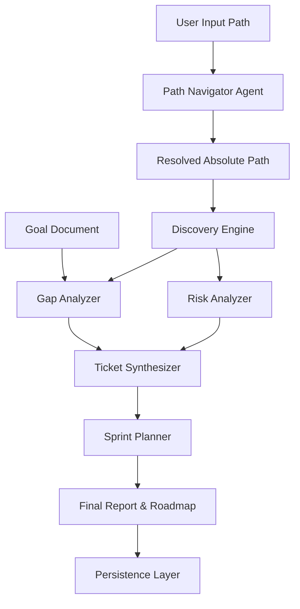

# ArchAI: AI-Powered Architect Assistant - Architecture Design

ArchAI is an automated system-designing and development-planning tool. It analyzes existing codebases, identifies gaps/risks, and produces a structured roadmap for development.

## 1. System Overview

ArchAI operates as a pipeline of specialized AI-driven modules:

## 2. Infrastructure Layer (New)

### 2.1 Logging & Error Handling
- **Centralized Logging**: Specialized module in `ai_architect/infrastructure/logging_utils.py` provides formatted console and file logging.
- **Custom Exceptions**: Defines `ArchAIError`, `AgentFailureError`, and `ConfigurationError` for fine-grained failure handling.

### 2.2 Configuration Management
- **ConfigManager**: Supports YAML, JSON, and Environment Variables (`ARCHAI_*`).
- **Singleton Pattern**: Ensures a single source of truth for system settings across all modules.

### 2.3 Data Persistence
- **Storage**: Uses SQLite for local persistent storage of audit reports and performance metrics.
- **Repository Pattern**: `PersistenceLayer` handles all SQL operations, providing an abstraction over raw database access.

### 2.4 Security Framework
- **Authentication**: Basic API Key verification for REST API integration.
- **Access Control**: Role-based access control (RBAC) placeholders for future multi-user support.

### 2.5 REST API
- **FastAPI**: Provides a swagger-documented interface for triggering audits and health monitoring.

## 3. Core Modules (Agentic)

### 3.1 Path Navigator Agent
- **Responsibility**: Resolve user-provided paths into valid absolute paths across all OS.
- **Outputs**: `PathNavigatorOutput` (Pydantic).

### 3.2 Discovery Engine
- **Responsibility**: Map project structure and tech stack.
- **Outputs**: `DiscoveryOutput` (Pydantic).

[... other agents ...]

## 4. Cross-Platform Stability
- **Agentic Path Resolution**: Uses Path Navigator.
- **Pathlib Foundation**: OS-agnostic path handling.

## 5. Scaling & Monitoring
- **Metrics Collection**: Every agent execution latency and success/failure is recorded in the persistence layer.
- **Scalability**: The system is designed to be stateless in the core, with state managed via the `PersistenceLayer`.

## 6. Future Roadmap
- **Documentation Auto-Gen**: Integrate Sphinx/pydoc to generate API documentation automatically.
- **Caching**: Implement a caching layer for LLM responses to reduce latency and costs.
- **Distributed Agents**: Allow agents to run in parallel or on different worker nodes using Celery or similar.
