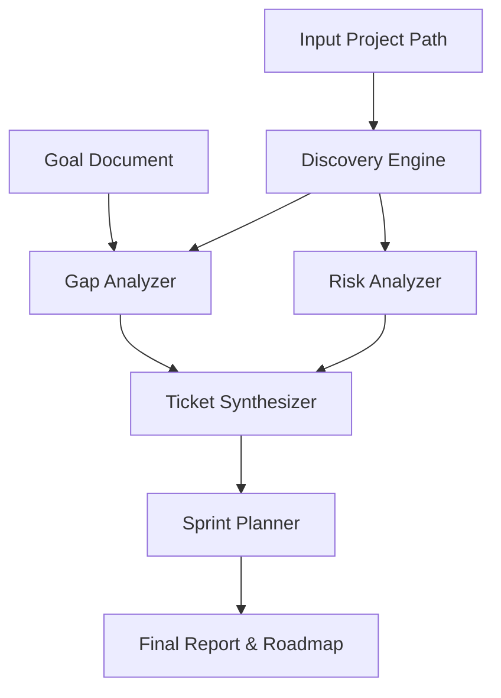

# ArchAI: AI-Powered Architect Assistant - Architecture Design

ArchAI is an automated system-designing and development-planning tool. It analyzes existing codebases, identifies gaps/risks, and produces a structured roadmap for development.

## 1. System Overview

ArchAI operates as a pipeline of specialized AI-driven modules:

## 2. Core Modules

### 2.1 Discovery Engine
- **Responsibility**: Map the project structure and understand the tech stack.
- **Inputs**: File system path.
- **Outputs**: Project metadata (Languages, Frameworks, Module Map, Business Logic summary).

### 2.2 Gap Analyzer
- **Responsibility**: Compare current implementation vs. the goal document.
- **Inputs**: Project metadata, Goal document.
- **Outputs**: List of missing features and architectural gaps.

### 2.3 Risk Analyzer (Architectural Auditor)
- **Responsibility**: Identify technical debt, bugs, and performance/security risks.
- **Inputs**: Source code samples, project structure.
- **Outputs**: Categorized list of technical issues.

### 2.4 Ticket Synthesizer
- **Responsibility**: Convert gaps and risks into actionable tickets.
- **Attributes**: 
    - Title, Description, Labels (Bug, Feature, Technical Debt).
    - Effort Estimate (Hours).
    - Priority (Critical, High, Medium, Low).
- **Logic**: Use LLM templates to ensure consistent Jira-style formatting.

### 2.5 Sprint Planner
- **Responsibility**: Create a 5-day developer roadmap.
- **Constraints**: 
    - Max 25 hours per sprint.
    - Day-by-day breakdown (approx. 5 hrs/day).
    - Higher priority tickets first.
- **Outputs**: Markdown-formatted schedule.

## 3. Technology Stack
- **Language**: Python 3.10+
- **AI Backend**: Ollama (Local LLM - qwen3-coder:480b-cloud recommended)
- **Data Persistence**: SQLite (for logging/metrics)
- **Output Formats**: CLI, JSON, Markdown.

## 4. Cross-Platform Stability
- **Path Handling**: Uses `pathlib` for all filesystem operations to ensure 100% compatibility across Windows, MacOS, and Ubuntu/Linux.
- **Environment Agnostic**: The system detects OS-specific paths and normalizes them for the AI context, ensuring consistent audits regardless of the host environment.

## 5. Scaling & Extensibility
- **Plugins**: New analyzers (e.g., specialized Security scanners) can be added by implementing the `BaseAnalyzer` interface.
- **Scaling UP**: Integrate with CI/CD pipelines to run audits on every PR.
- **Scaling DOWN**: Skip deep code analysis for large projects and focus on structure-only discovery.

## 6. Future Roadmap
- **ML/NLP Improvements**: Fine-tune models on large-scale architectural pattern datasets to improve detection accuracy.
- **CI/CD Integration**: Develop GitHub Actions/GitLab CI plugins to surface risks directly in pull requests.
- **Dynamic Effort Estimation**: Use historical developer data to adjust ticket hour estimates based on actual completion times.
- **Visual Timelines**: Generate Gantt charts or Mermaid.js timelines for even better roadmap visualization.
- **Plugin System**: Standardize the `Analyzer` API to allow community-contributed scanners (e.g., specific for React, Rust, or Kubernetes).
