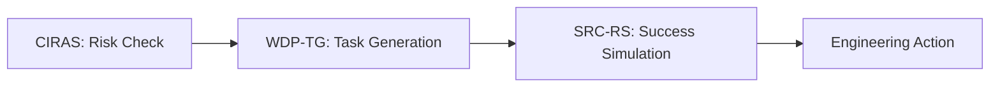

# Tutorial: Chaining Workflows

ArchAI agents are designed to flow into one another. This guide shows how to combine them for a full "Insight-to-Plan" automation.

## The Standard Pipeline

The most common workflow is the **Plan Validation** loop:



### Automation Example (Bash)

You can chain these in a single script for your PR reviews:

```bash
#!/bin/bash
# 1. Check if the change target is safe
RISK=$(ai-architect impact $TARGET --strict --json)
if [ $? -ne 0 ]; then
  echo "HIGH RISK DETECTED: PR Blocked."
  exit 1
fi

# 2. If safe, generate a plan
ai-architect plan "$GOAL" --json > sprint_plan.json

# 3. Simulate success and post to Slack
ai-architect simulate-sprint "$GOAL" --json > confidence.json
```

## Advanced: Integration via API

For custom internal tools, use the API endpoints to create dynamic dashboards:

1. Call `POST /impact` to get real-time risk scores for every active PR.
2. Call `POST /plan` to automatically populate your team's backlog.
3. Call `POST /release-confidence` on your `main` branch daily to track delivery health.
